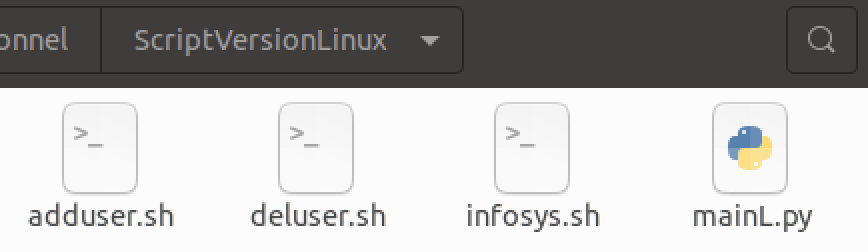
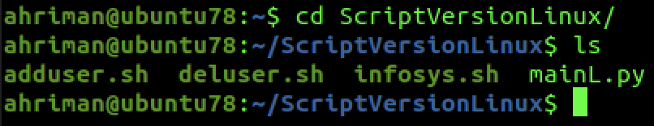
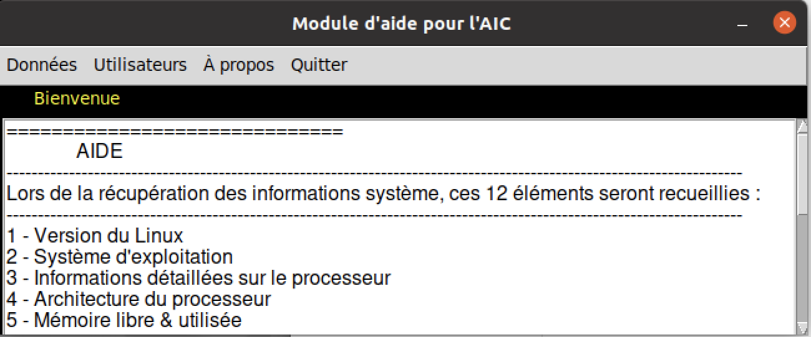
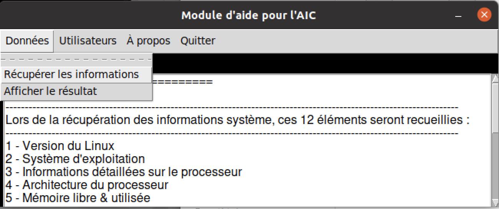
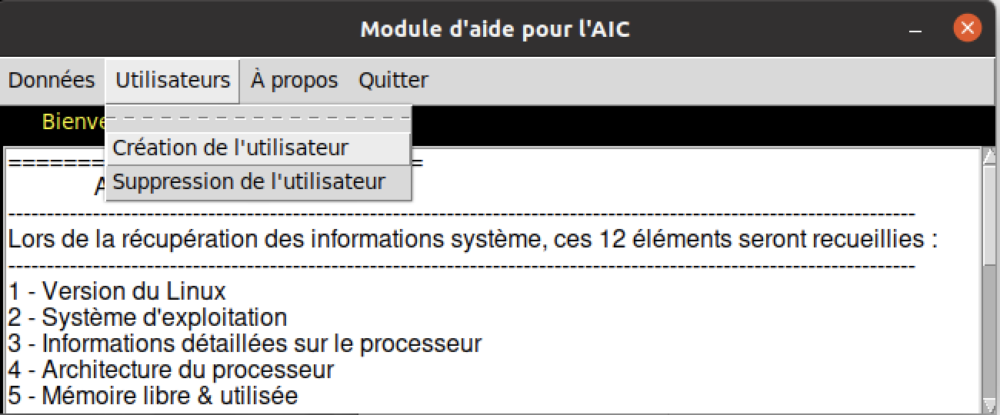
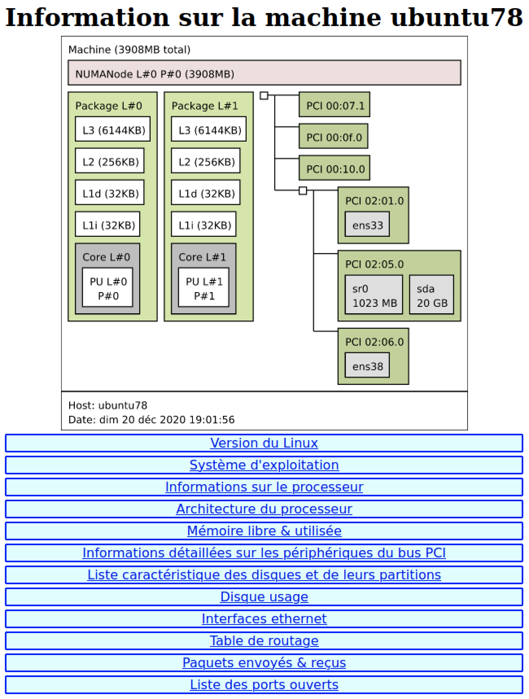
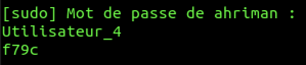

# Récupération des informations d'un poste Linux et création / suppression de compte utilisateur. 

   

## Pour commencer

L'idée est de récupérer les informations système d'une machine Linux, mais aussi de créer un compte utilisateur ou de le supprimer. 

----------------------------------------------------------------------------------------------------------------------
Lors de la récupération des informations système, ces 12 éléments seront recueillis :
----------------------------------------------------------------------------------------------------------------------
- 1 - Version du Linux
- 2 - Système d'exploitation
- 3 - Informations détaillées sur le processeur
- 4 - Architecture du processeur
- 5 - Mémoire libre & utilisée
- 6 - Informations détaillées sur les périphériques du bus PCI
- 7 - Liste caractéristique des disques et de leurs partitions
- 8 - Disque usage
- 9 - Interface ethernet
- 10 - Table de routage
- 11 - Paquets envoyés & reçus
- 12 - Liste des fichiers ouverts
---------------------------------------------------------------------------------------------------------------------
Création & suppression de comptes :
---------------------------------------------------------------------------------------------------------------------
- Création de l'utilisateur sous forme de utilisateur_'nombre aléatoire' et mot de passe aléatoire à 4 caractères. 
- L'information sur le Login & le mot de passe sera affichée dans la fenêtre de votre terminal. 

### Prérequis

- Machine Linux
- Connexion SSH vers la machine cible
- Un Terminal
- Un navigateur internet
- quelques notions en (Python / html / Bash / CGI) pour améliorer le programme par rapport à vos besoins :)

### Installation

- Python3 (sudo apt-get install python3)
- lstopo pour afficher la topologie du système (sudo apt-get install hwloc)

## Démarrage

- Ouvrir le Terminal et aller dans le dossier ScriptVersionLinux

> Le dossier

> depuis le Terminal

- Exécutez la commande(#python3 mainL.py)

> Lancement du programme depuis le Terminal

- Vous pouvez maintenant suivre les instructions sur la fenêtre principale de l'application

> Fenêtre de l'application avec l'aide qui se trouve en bas 

> Menu pour lancer la récupération ainsi que l'affichage des informations système

> Menu pour créer / supprimer un utilisateur

> Affichage de la page où trouver toutes les informations (cliquable)

> Création de compte avec l'affichage du login / mdp de l'utilisateur

## Fabriqué avec

- MacOS Catalina 10.15.7
- GNS3 2.2.16
- VMWare Fusion 12.1.0
- Machine VM Ubuntu 20.04.1 LTS
- Visual Studio Code 1.52.1

## Versions

**Dernière version stable :** 1.0

## Auteurs

* **François PARIZAD** [https://github.com/AhrimanTech/](https://github.com/AhrimanTech/)

## License

 - voir le fichier [LICENSE.md](https://github.com/AhrimanTech/OpenClassroomProjet6/blob/main/LICENSE) pour plus d'informations
